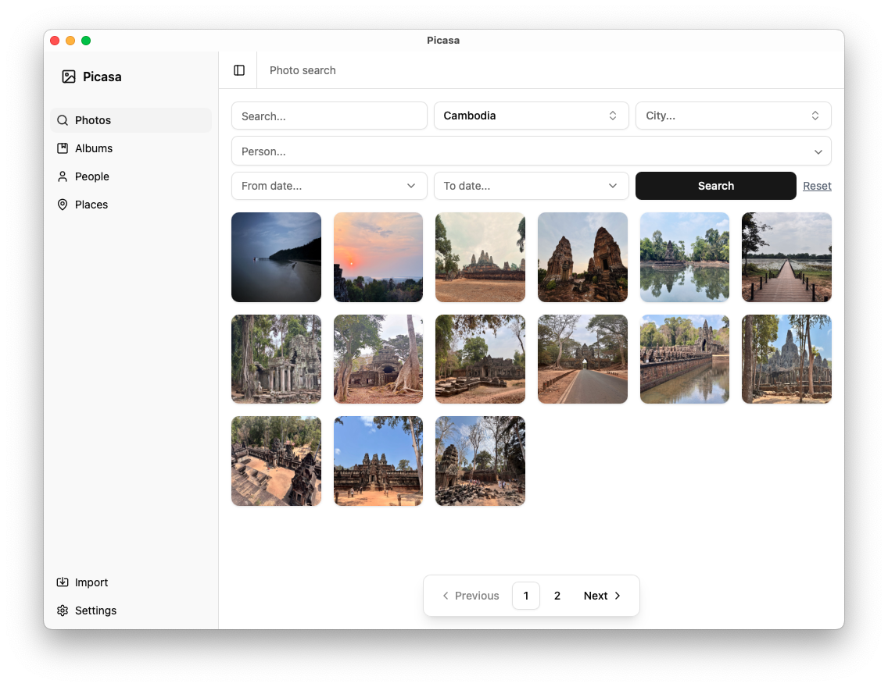

# picasa-rs

A personal project to help sort through all my photos by building a photo management tool with AI features while keeping everything local.

## Key Features

- 📁 Scanning: recursive, EXIF extraction, HEIF support
- 🔍 Search: semantic search with CLIP embeddings, geographic/temporal filtering and person-based search.
- 👤 Face recognition: face detection, clustering, and person identification with manual review workflows
- 🛠️ Multiple Interfaces: CLI, GUI, and MCP server

## Interfaces

### 🖥️ GUI

Tauri-based desktop application with React/TypeScript frontend



### ⌨️ CLI

Built with clap-rs for quick testing and running batch operations

```bash
# Scan and index photos
cargo make cli scan /path/to/photos --with-exif --with-hash

# Generate embeddings for semantic search
cargo make cli embed

# Search photos with natural language
cargo make cli search --text "sunset over mountains" --country "Spain"

# Face detection and recognition
cargo make cli face detect
cargo make cli face recognize --similarity-threshold 0.7 --dry-run
```

### 🔗 MCP Server Integration

Integrate with AI assistants like Claude Desktop via Model Context Protocol:

**Usage with Claude Desktop:**

```json
{
  "mcpServers": {
    "Picasa": {
      "command": "<picasa-rs>/target/release/picasa-mcp",
      "env": {
        "PICASA__CLIP_MODEL__DIR": "<picasa-rs>"
      }
    }
  }
}
```

## Getting Started

### Prerequisites

**System Dependencies:**

- `libheif` (for HEIC image support)
- `libpq` (PostgreSQL client library)

**AI Models:**

- [CLIP model files](https://huggingface.co/openai/clip-vit-base-patch32/tree/refs%2Fpr%2F62) for semantic search and embeddings

### Installation

1. **Set up database:**

```bash
cargo make --profile development db-build
cargo make --profile development db-start
cargo make --profile development db-migrations
```

2. **Set up face detection server:**

```bash
(cd python/face_detection && uv sync)
cargo make face-ws
```

### Workflow

1. **Scan Photos**: `cargo make cli scan /path/to/photos --with-exif --with-hash`
2. **Generate Embeddings**: `cargo make cli embed`
3. **Detect Faces**: `cargo make cli face detect`
4. **Launch GUI**: `cargo make gui`

## Architecture

```
┌─────────────────┐    ┌─────────────────┐    ┌─────────────────┐
│   Desktop GUI   │    │   CLI Tool      │    │   MCP Server    │
│   (Tauri/React) │    │   (clap)        │    │   (rmcp)        │
└─────────┬───────┘    └─────────┬───────┘    └─────────┬───────┘
          │                      │                      │
          └──────────────────────┼──────────────────────┘
                                 │
                   ┌─────────────▼─────────────┐    ┌──────────────────┐
                   │      Picasa Core          │───►│  Face Detection  │
                   │   (Rust Library)          │    │     Server       │
                   │  - Photo Management       │    │   (Python/       │
                   │  - AI Services            │    │   InsightFace)   │
                   │  - Database Layer         │    └──────────────────┘
                   └─────────────┬─────────────┘
                                 │
                   ┌─────────────▼─────────────┐
                   │     PostgreSQL            │
                   │   + pgvector + postgis    │
                   │(metadata, embeddings,...) │
                   └───────────────────────────┘
```

## Development Status

🚧 **In progress:**

- [ ] Packaging (tauri, clip model, postgres, python server)
- [ ] Albums/collections feature
- [ ] Photo import interface with background embedding process
- [ ] Settings interface
- ...
